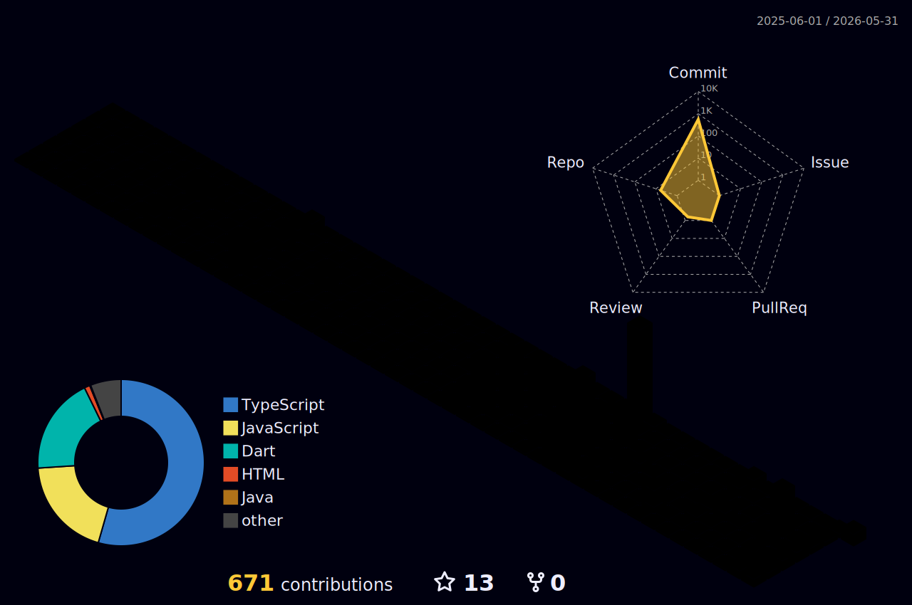

<!-- HEADER -->

  

  

 

  

 

<!-- ABOUT ME -->
<table width="100%" border="0">
  <tr>
    <td width="60%" valign="top">
      <h2>🌌 About My Universe</h2>
      
My journey into software engineering began with a fascination for how digital systems connect people. Today, as a CS undergraduate at Angel College of Engineering and Technology, I've transformed that curiosity into building robust, real-time applications.

      
Whether I'm engineering a bidirectional chat system using the <b>MERN stack</b> or crafting a cross-platform smart campus solution in <b>Flutter</b>, my mission remains the same: writing clean, scalable code that delivers flawless user experiences.

      
I cut my teeth in the professional world as a <i>Web Developer Intern at Tamizhi AI</i>, squashing UI bugs and optimizing APIs. Before that, my time as an <i>SEO Analyst at QuantumQLabs</i> taught me the critical importance of web performance and visibility. Now, my tech arsenal is forged in JavaScript, Dart, and real-time sockets. Welcome to my digital universe!

    </td>
    <td width="40%" align="center" valign="middle">

    </td>
  </tr>
</table>

 

<!-- TECH ARSENAL -->
<h2 align="center">🛠️ Tech Arsenal</h2>

  
<i>Weapons of Choice for conquering the digital realm</i>

  

 

  

 

<!-- DEVELOPER IDENTITY -->
<table width="100%" border="0">
  <tr>
    <td width="50%" align="center" valign="top">
      <h3>🌐 MERN Stack Wizardry</h3>
      
      
Building scalable, real-time backend systems and gorgeous, responsive frontends using React, Express, MongoDB, and Socket.io.

    </td>
    <td width="50%" align="center" valign="top">
      <h3>📱 Flutter Mobile App Development</h3>
      
      
Crafting cross-platform mobile experiences with Dart and Flutter. Integrating with Firebase, Node.js, and implementing role-based access controls.

    </td>
  </tr>
</table>

 

<!-- PROJECTS UNIVERSE -->
<h2 align="center">🚀 Projects Universe</h2>

<table width="100%" border="0">
  <tr>
    <td width="33%" valign="top">
      
        
      
A full-stack bidirectional chat system supporting 100+ concurrent users. Built with <b>MERN Stack</b>, <b>Socket.io</b>, and <b>JWT</b>.

    </td>
    <td width="33%" valign="top">
      
        
      
A comprehensive music streaming platform replicating Spotify's core features. Built with <b>React</b>, <b>TypeScript</b>, <b>Node.js</b>, and <b>Cloudinary</b>.

    </td>
    <td width="33%" valign="top">
      
        
      
A cross-platform <b>Flutter</b> app linked with a Node.js + MongoDB backend. Implements RBAC for students/faculty/admin and QR-code attendance.

    </td>
  </tr>
</table>

 

  

 

 

<h2 align="center">⚡ Contribution Activity (3D)</h2>

  

 

<!-- CONTACT LINKS -->
<h2 align="center">📡 Transmission / Contact Links</h2>

  
  
  

 

<!-- FOOTER -->

  
  
<i>"System initializing... Welcome to my matrix."</i>

  

